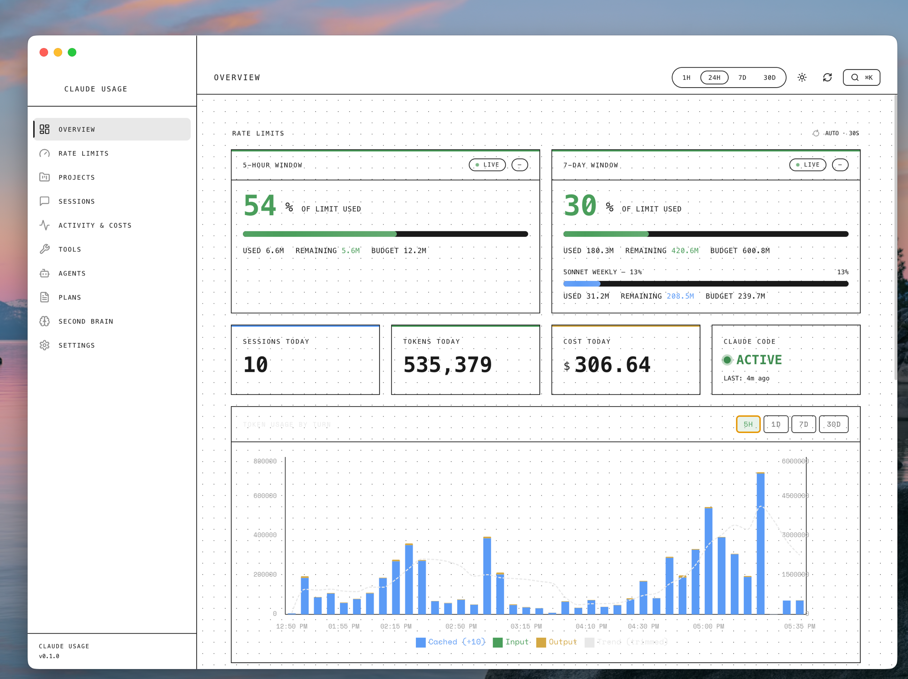
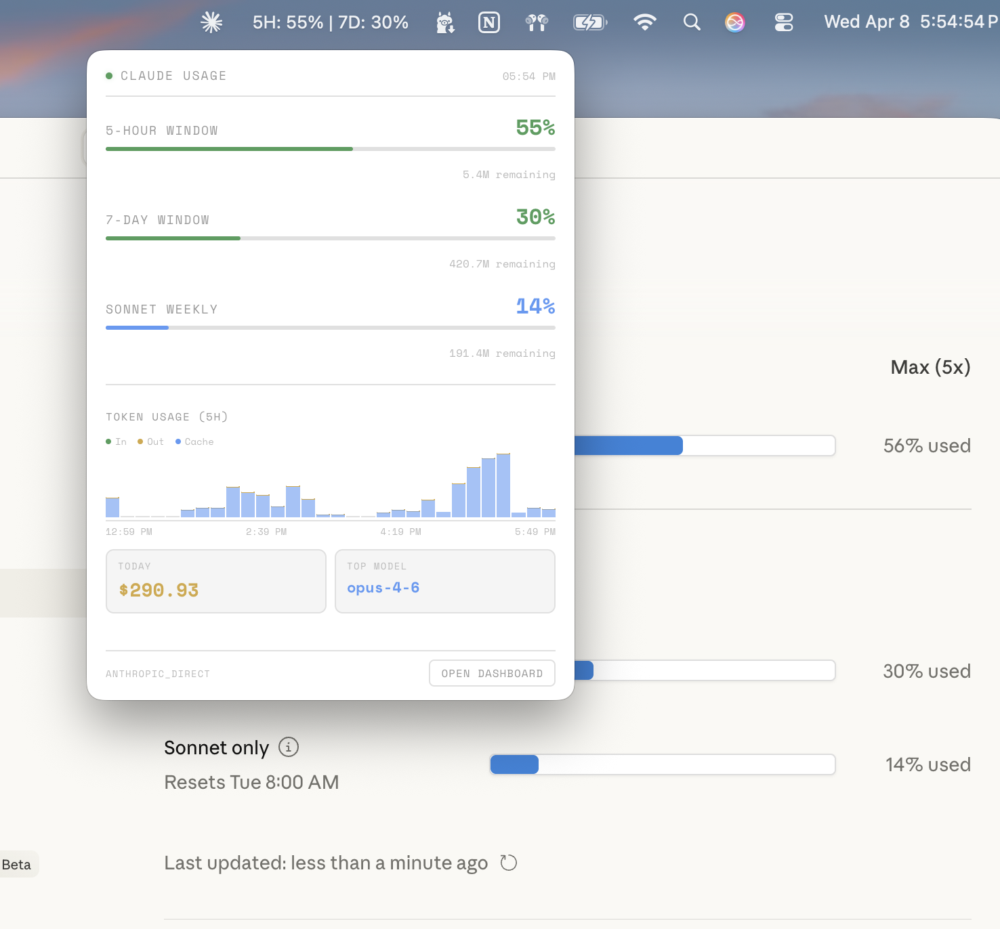
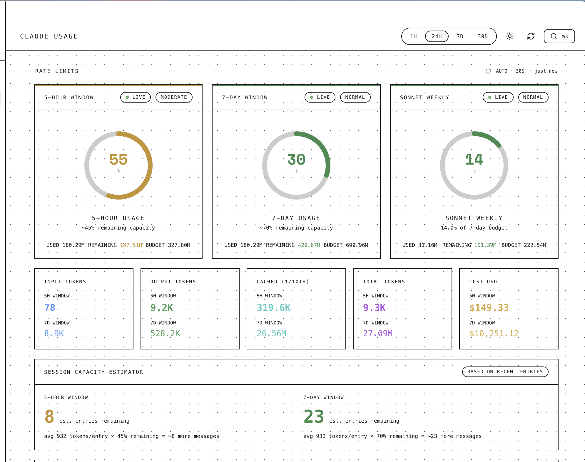
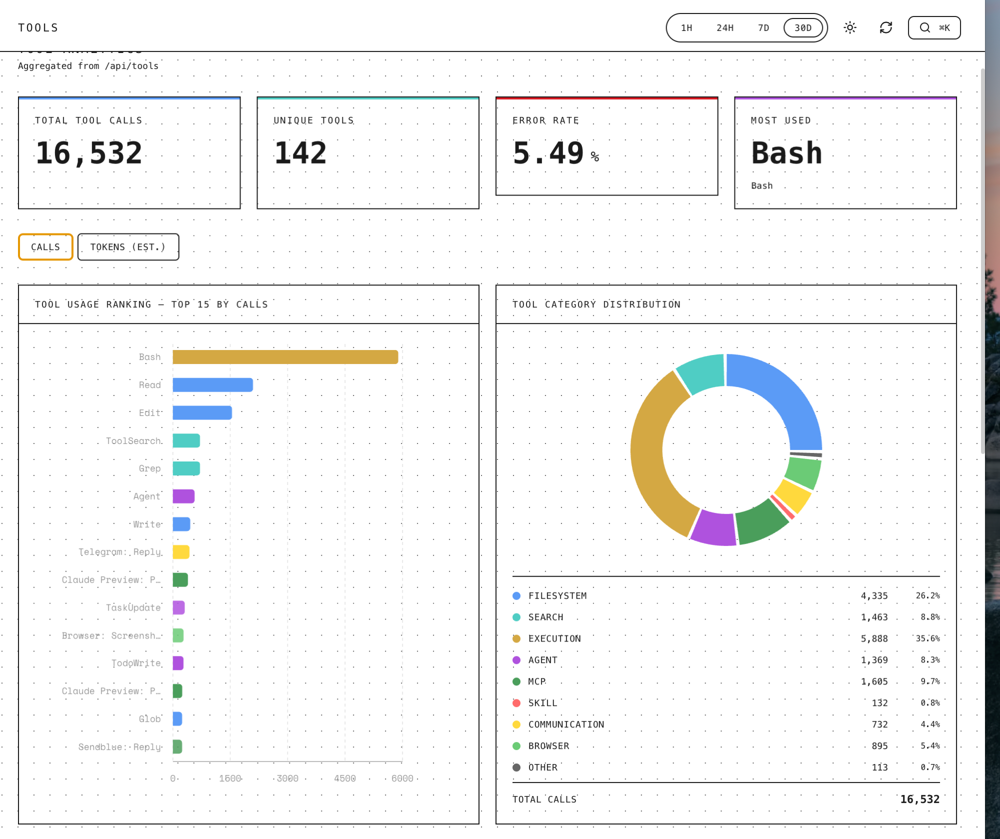

# Claude Usage Dashboard

Real-time token usage monitoring for Claude Code power users.

| Overview | Menubar Widget |
|----------|---------------|
|  |  |

| Rate Limits | Tools |
|-------------|-------|
|  |  |

---

## Features

- Real-time 5-hour and 7-day rate limit monitoring
- macOS menubar tray widget with live percentages
- Token usage charts with 5-minute bucketed stacked bars
- Per-agent token breakdown and cost tracking
- Session history and activity heatmaps
- Tool usage analytics
- Nothing UI design with light/dark mode
- Configurable via settings page

---

## Prerequisites

- Node.js 20+
- Claude Code CLI with Max subscription
- macOS (Electron build targets arm64)

---

## Quick Start

```bash
git clone https://github.com/eastonplace-ai/claude-subscription-usage-meter.git
cd claude-subscription-usage-meter
cp .env.example .env.local  # optional: add Supabase credentials
npm install
npm run dev
```

---

## How It Works

- Reads Claude Code's local data files from `~/.claude/`
- Extracts session history, costs, tool usage, and agent logs
- Optionally connects to Supabase for cached rate limit data
- Falls back to Anthropic API via OAuth (from macOS Keychain) for live usage

---

## Data Sources

| Data | Source |
|---|---|
| Session history | `~/.claude/projects/` (local JSONL files) |
| Cost and token usage | Parsed from session transcripts |
| Tool usage | Extracted from session tool call records |
| Rate limit percentages (5H / 7D) | Supabase cache or Anthropic API via OAuth |
| Agent token log | `~/.claude/agents/token-log.jsonl` (optional) |

---

## Supabase Setup (Optional)

Supabase is used to cache rate limit percentages written by Claude Code hooks. Without it, the app fetches live data directly from the Anthropic API using the OAuth token stored in macOS Keychain.

To set up:

1. Create a new Supabase project
2. Open the SQL editor and run `supabase/migration.sql`
3. Copy your project URL and service role key into `.env.local`

The migration creates two tables:

- `claude_usage_cache` — single-row cache for 5H/7D rate limit percentages, updated by your Stop hook
- `agent_token_log` — append-only log of per-task token usage from Claude Code agents

---

## Hooks Setup

Claude Code hooks write rate limit data and token usage into the dashboard's data stores. Configure them in `~/.claude/settings.json`.

See `config/hooks-example.json` for the hook structure. Two hooks are used:

- **Stop hook** — fires when a Claude Code session ends; reads current rate limit state and writes it to `claude_usage_cache` in Supabase
- **Turn logger** (UserPromptSubmit) — fires on each user message; writes per-turn token counts to `agent_token_log`

Replace `/path/to/your/fetch-live-usage.js` and `/path/to/your/turn-logger.js` with the actual paths to your hook scripts.

---

## Building the App

```bash
npm run build        # builds Next.js + Electron + .app bundle
```

Output: `dist/mac-arm64/Claude Usage Dashboard.app`

---

## Configuration

| Variable | Required | Description |
|---|---|---|
| `SUPABASE_URL` | No | Supabase project URL. Falls back to Anthropic API if unset. |
| `SUPABASE_SERVICE_ROLE_KEY` | No | Supabase service role key for server-side queries. |
| `TOKEN_LOG_PATH` | No | Path to agent token log. Default: `~/.claude/agents/token-log.jsonl` |
| `OBSIDIAN_VAULT_PATH` | No | Path to Obsidian vault. Required for Second Brain page only. |
| `WORKSPACE_DIR` | No | Path to your Claude Code workspace directory. |
| `KHOJ_URL` | No | Khoj semantic search server URL. Default: `http://localhost:42110` |
| `KHOJ_API_KEY` | No | Khoj API key for vault search queries. |

---

## Architecture

The app is an Electron shell wrapping a Next.js frontend. The renderer process loads the Next.js app, which fetches data from local API routes. Those routes read directly from `~/.claude/` on disk or query Supabase when credentials are present.

The menubar tray widget runs as a separate Electron window that polls the API routes on a 60-second interval.

See `claude-usage-data-flow.drawio` for the full data flow diagram.

---

## Usage Tips

- Use the 1H filter during active coding to watch real-time token burn
- The 5H window is your primary constraint — watch it more than 7D
- Cached tokens are displayed at 1/10 scale in charts so input/output remain visible
- The menubar widget updates every 60 seconds — configurable in Settings
- Toggle dark/light mode with the theme switch in the header

---

## Contributing

Contributions are welcome. Please open an issue before submitting a pull request for significant changes. For bug fixes and small improvements, a PR is fine directly.

1. Fork the repository
2. Create a feature branch (`git checkout -b feature/your-feature`)
3. Commit your changes
4. Open a pull request

---

## License

MIT
