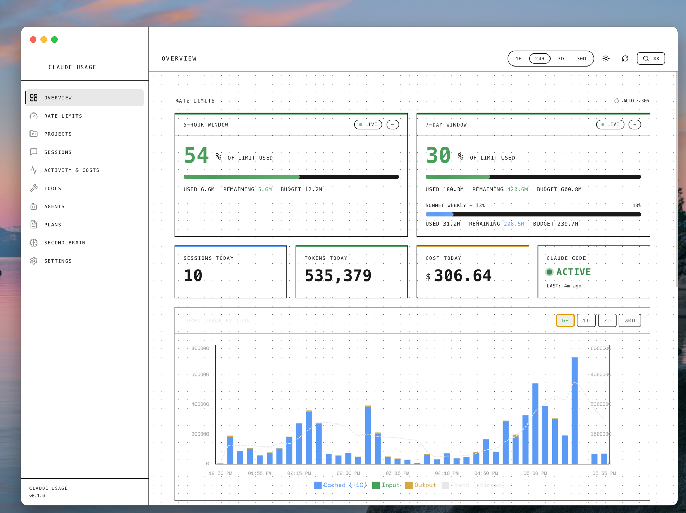
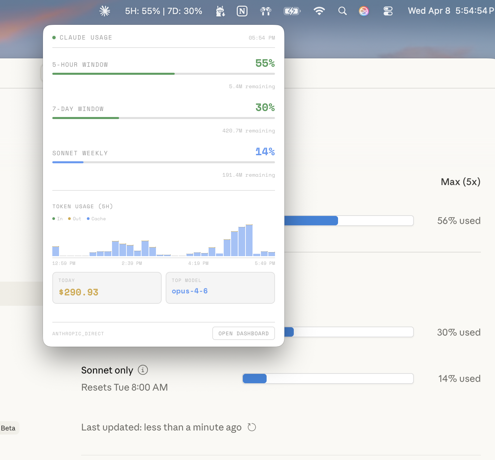

  

<h1 align="center">Claude Usage Dashboard</h1>

<strong>See where your Claude Code budget is going.</strong>

  
  
  
  

Claude Usage Dashboard is a macOS Electron and Next.js app that turns Claude Code's local session data into a live view of rate limits, tokens, costs, tools, and activity.

  

## What it shows

| View | Signal |
| --- | --- |
| Overview | Current usage, token totals, costs, and recent activity. |
| Rate limits | Five-hour and seven-day windows, including menubar percentages. |
| Sessions | History, heatmaps, and per-agent token breakdowns. |
| Tools | Tool usage analytics and activity patterns. |

## Features

- Five-hour and seven-day rate-limit monitoring.
- A live macOS menubar widget.
- Bucketed token charts with input, output, cache, and cost data.
- Session history and activity heatmaps.
- Per-agent token breakdowns.
- Tool usage analytics.
- Light and dark mode with the Nothing UI direction.
- A settings page for local configuration.

## Data flow

~~~text
Claude Code local files
          |
          v
Session, cost, token, and tool parsers
          |
          +--> Next.js API routes
          |      +--> dashboard views
          |      +--> menubar widget
          |
          +--> optional Supabase cache
          +--> Anthropic API fallback through OAuth in macOS Keychain
~~~

The app reads local data from <code>~/.claude/</code>. Supabase is optional. The local hooks and dashboard do not send conversation text to another service.

## Run locally

Requirements:

- macOS
- Node.js 20+
- Claude Code with a Max subscription

~~~bash
git clone https://github.com/eastonplace-ai/claude-subscription-usage-meter.git
cd claude-subscription-usage-meter
cp .env.example .env.local
npm install
npm run dev
~~~

The environment file is optional for local parsing. Add Supabase values only when using the shared cache.

## Build

~~~bash
npm run build
~~~

The build produces a macOS Electron application under <code>dist/mac-arm64/</code>.

## Privacy

The app reads local Claude Code files, optional local hook output, and OAuth-backed usage data. Do not commit credentials, local transcripts, databases, or personal configuration.

See [the data sources](#data-sources) before enabling optional integrations.

### Data sources

| Data | Source |
| --- | --- |
| Session history | <code>~/.claude/projects/</code> |
| Token and cost data | Parsed session transcripts |
| Tool usage | Session tool-call records |
| Rate-limit percentages | Optional Supabase cache or Anthropic API through OAuth |
| Agent token log | Optional <code>~/.claude/agents/token-log.jsonl</code> |

## License

MIT. See [LICENSE](LICENSE).